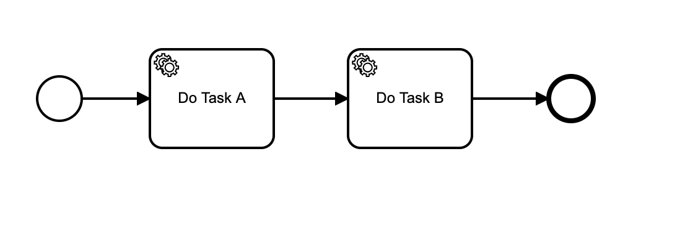
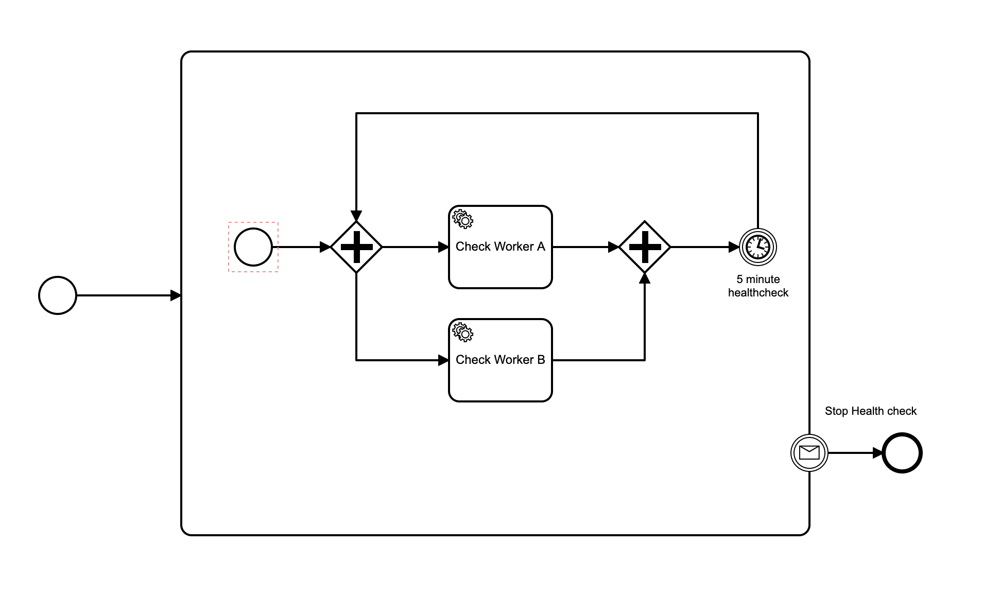

# Zeebe Worker Healthchecks POC

An idea about how to prove that at least one worker per task type has a connection to the broker.

You can instrument the broker at an infrastructure level to alert you when it is down. You can also instrument workers to alert when they are down.

However, can you instrument the workers to alert you when they have no communication with the broker?

One idea is to run a timer process on the broker that heartbeat pings on each task type, and a worker has to ping a healthcheck endpoint when it gets this special heartbeat task.

This approach provides proof that your business process can be serviced end-to-end at a given point in time, with the caveat that you need to ensure the completeness of the heartbeat process.

The heartbeat task should have the same task type as the business logic task (in the Node client at least, each worker has a single task type, and a dedicated gRPC channel).

Here is what it could look like. Given this business process, with two tasks, of type Task A and Task B:

You create a heartbeat process like this:

It has an infinite loop, so it runs continuously. The interrupting boundary event is so you can ensure that multiple instances are not started. In your application code you simply publish the stop message (which will cancel all running instances), and create a new instance. See [this blog article](https://zeebe.io/blog/2019/08/zeebe-message-correlation/) about message correlation in Zeebe.

In your job workers, you put some logic at the start of the handler to ping a healthcheck endpoint if the job has the heartbeat variable set. You could use [healthchecks.io](https://healthchecks.io), as I have in this example, or your own infrastructure.

## Some limitations of this approach

* This approach will alert you when there are zero workers for a given task type that ping the healthcheck endpoint. It cannot make a statement about the number of workers running for a given task type, other than that it is non-zero.
* If the worker cannot fetch the healthcheck monitor endpoint, you will be alerted that no worker is running for that task type, however, it may be running but unable to reach the healthcheck endpoint.

## Notes

* If you have a separate healthcheck monitor in your worker, that makes a statement about whether it is running. If you get no alert for the worker down, and an alert for this heartbeat going down, it means the worker is up, but not getting tasks from the broker. Either the broker is down, the heartbeat process has been stopped, or the communication between the worker and the broker is down.

* I used a variable rather than a custom header because it is less wiring in the modeler, which means less complexity to set up. You need the variable anyway to correlate the stop message.

When designing a system with Zeebe, you need to look at the different things that can go wrong, and figure out how you will detect them and alert on them.

